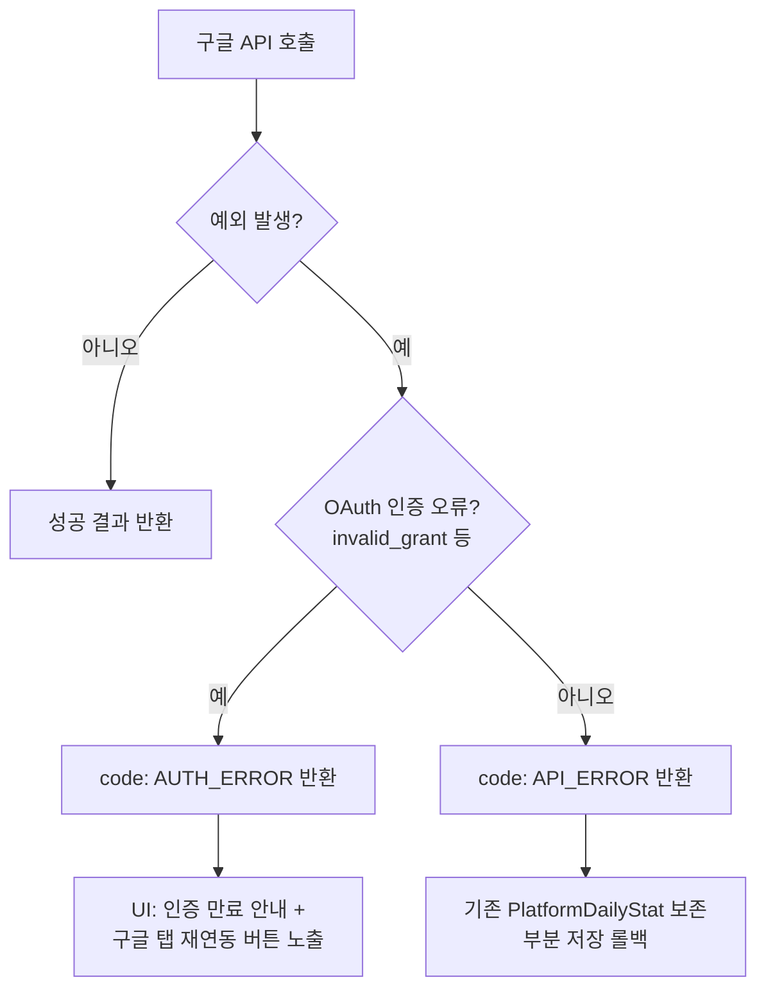

# 설계 문서 (Design Document)

## Overview
### 개요

본 설계는 네이버 전용 광고 관리 시스템을 **멀티 플랫폼(네이버/구글/메타/당근) 광고 관리 시스템**으로 확장하기 위한 기반구조와 **구글 광고 연동**을 다룬다. 설계의 최우선 원칙은 **기존 네이버 시스템 무손상(Requirement 1)** 이며, 모든 변경은 추가(additive) 방식으로만 이루어진다.

핵심 설계 전략은 다음과 같다.

1. **어댑터 레이어 도입**: 모든 플랫폼이 구현하는 공통 인터페이스 `AdPlatformAdapter`를 정의하여, 통합 대시보드와 보고서가 플랫폼 구현 세부사항에 의존하지 않도록 한다(Requirement 2).
2. **폴더 격리**: 신규 플랫폼 코드는 `src/services/platforms/{platform}/`, API 라우트는 `src/app/api/{platform}/`로 격리하여 한 플랫폼 변경이 다른 플랫폼·네이버 시스템에 영향을 주지 않도록 한다(Requirement 3).
3. **DB 추가 전용 확장**: 신규 테이블 `PlatformAccount`, `PlatformDailyStat`만 추가하고 기존 네이버 테이블은 일절 건드리지 않는다(Requirement 4, 1).
4. **연동 기반 표시 규칙**: 통합 대시보드는 연동된 플랫폼만 합산·표시하고, 미연동 플랫폼은 흐림 처리 + "연동하기" 카드로 노출한다(Requirement 7).
5. **구글 우선 구현, 메타/당근 구조 확장**: 구글은 `google-ads-api` 라이브러리로 완전 구현하고, 메타/당근은 인터페이스 구현만으로 추가 가능한 스텁 구조로 둔다(Requirement 9~11).

### 기존 스택 (변경 없음)

- **프레임워크**: Next.js (App Router) + TypeScript
- **DB**: PostgreSQL + Prisma ORM
- **인증**: NextAuth (`getServerSession(authOptions)` 패턴)
- **검증**: zod (기존 의존성)
- **테스트**: vitest + fast-check (기존 의존성, 속성 기반 테스트 지원)

### 신규 도입

- **구글 연동**: `google-ads-api` npm 라이브러리 (신규 의존성)

## Architecture
### 아키텍처

어댑터 레이어가 UI와 각 플랫폼 구현 사이에 위치하며, 네이버 하위 시스템은 기존 경로를 그대로 유지하는 **병렬 격리** 구조다.

```mermaid
graph TB
    subgraph UI["UI 레이어 (App Router)"]
        DASH["통합 대시보드<br/>/dashboard"]
        SIDEBAR["사이드바 네비게이션<br/>연동 상태 점 표시"]
        CONN["계정 연동 화면<br/>탭: 네이버/구글/메타/당근"]
        GMGMT["구글 광고 관리 화면<br/>/google"]
    end

    subgraph ADAPTER["어댑터 레이어 (신규)"]
        IFACE["AdPlatformAdapter 인터페이스<br/>src/services/platforms/types.ts"]
        REGISTRY["adapterRegistry<br/>platform → adapter 매핑"]
    end

    subgraph PLATFORMS["플랫폼 구현 (격리된 폴더)"]
        GOOGLE["google/google-ads.service.ts<br/>google-ads-api 사용"]
        META["meta/ (스텁, 미구현)"]
        DAANGN["daangn/ (스텁, 미구현)"]
    end

    subgraph NEWAPI["신규 API 라우트"]
        GAPI["/api/google/*"]
        PACCT["/api/platform-accounts"]
    end

    subgraph NEWDB["신규 DB 테이블 (추가 전용)"]
        PA["PlatformAccount"]
        PDS["PlatformDailyStat"]
    end

    subgraph NAVER["네이버 하위 시스템 (무손상 · 병렬 유지)"]
        NAPI["/api/naver/* (변경 없음)"]
        NSVC["naver-ads.service.ts (변경 없음)"]
        NDB["NaverAdsAccount, Campaign,<br/>AdGroup, Keyword, DailyMetric,<br/>KeywordDailyStat, SyncLog (변경 없음)"]
        NACCT["/api/accounts (변경 없음)"]
    end

    DASH --> REGISTRY
    GMGMT --> GAPI
    CONN --> PACCT
    CONN -.네이버 탭은 기존 폼 재사용.-> NACCT
    SIDEBAR --> REGISTRY

    REGISTRY --> IFACE
    IFACE -.구현.-> GOOGLE
    IFACE -.구현.-> META
    IFACE -.구현.-> DAANGN

    GAPI --> GOOGLE
    PACCT --> PA
    GOOGLE --> PDS
    GOOGLE --> PA

    NACCT --> NDB
    NAPI --> NSVC
    NSVC --> NDB

    DASH -. 네이버 지표는 기존 경로로 조회 .-> NAPI

    style NAVER fill:#e8f5e9,stroke:#2e7d32
    style ADAPTER fill:#e3f2fd,stroke:#1565c0
    style PLATFORMS fill:#f3e5f5,stroke:#6a1b9a
    style NEWDB fill:#fff3e0,stroke:#e65100
```



### 네이버 무손상 보장 전략 (Requirement 1)

| 보장 항목 | 설계 방법 |
|-----------|-----------|
| 코드 무손상 | `naver-ads.service.ts`, `src/app/api/naver/*`, `/api/accounts`는 import도 수정도 하지 않음. 신규 코드는 별도 폴더에만 작성. |
| 스키마 무손상 | 신규 모델(`PlatformAccount`, `PlatformDailyStat`)만 schema.prisma에 **추가**. 기존 모델 블록은 한 줄도 변경하지 않음. |
| 마이그레이션 안전성 | 생성된 마이그레이션 SQL을 검수하여 `CREATE TABLE`만 포함하고 기존 네이버 테이블에 대한 `ALTER/RENAME/DROP`이 없음을 확인하는 가드 절차(마이그레이션 가드 테스트)를 둔다. |
| 런타임 격리 | 네이버 데이터는 통합 대시보드에서도 기존 `/api/naver/*` 경로로 조회하며, 어댑터 레이어를 통해 네이버 코드를 재작성하지 않는다. |
| 회귀 검증 | 확장 이전 네이버 API 응답 구조/값 회귀 테스트를 유지한다(Requirement 1.4). |

> **설계 결정**: 네이버는 `AdPlatformAdapter`로 강제 마이그레이션하지 않는다. 네이버를 어댑터로 감싸려면 기존 코드 호출 방식을 바꿔야 할 위험이 있으므로, 네이버는 기존 경로를 유지하고 통합 대시보드가 네이버 데이터를 읽을 때만 기존 API를 호출한다. 신규 플랫폼(구글 등)만 어댑터를 통해 통합한다. 이는 Requirement 2.3("플랫폼 데이터 조회는 어댑터를 통해서만")을 신규 플랫폼에 적용하면서 네이버 무손상을 동시에 달성하는 절충안이다.

## Components and Interfaces
### 컴포넌트 및 인터페이스

### 1. 공통 어댑터 인터페이스 — `src/services/platforms/types.ts`

```typescript
// 플랫폼 식별자 (네이버 포함 — 식별/표시용)
export type Platform = 'NAVER' | 'GOOGLE' | 'META' | 'DAANGN';

// 신규 PlatformAccount에 저장 가능한 플랫폼 (네이버는 기존 테이블 사용)
export type ManagedPlatform = 'GOOGLE' | 'META' | 'DAANGN';

// 공통 지표 (모든 플랫폼 공유)
export interface CommonMetrics {
  impressions: number; // 0 이상의 정수
  clicks: number;      // 0 이상의 정수
  ctr: number;         // 0~100 백분율
  cpc: number;         // 0 이상
  cost: number;        // 0 이상
}

// 구글 전용 추가 지표
export interface GoogleMetrics {
  conversions: number;
  cpa: number;
  roas: number;
  conversionValue: number;
}

// 캠페인 공통 표현
export interface PlatformCampaign {
  id: string;       // 플랫폼 측 캠페인 식별자
  name: string;
  status: string;
  budget?: number;
}

// 기간 단위 통계 (공통 + 플랫폼 특수지표는 extra에 보관)
export interface PlatformStat {
  campaignId: string;
  date: string;            // YYYY-MM-DD
  metrics: CommonMetrics;
  extra?: Record<string, unknown>; // 예: GoogleMetrics
}

export interface DateRange {
  since: string; // YYYY-MM-DD
  until: string; // YYYY-MM-DD
}

export interface BalanceInfo {
  amount: number;
  currency: string;
}

// 어댑터 호출 표준 결과 (네이버 서비스의 success/error 패턴 계승)
export type AdapterResult<T> =
  | { success: true; data: T }
  | { success: false; error: string; code?: AdapterErrorCode };

export type AdapterErrorCode =
  | 'AUTH_ERROR'       // refresh_token 만료/무효
  | 'INVALID_RANGE'    // 잘못된 기간
  | 'API_ERROR'        // 외부 API 실패
  | 'NOT_IMPLEMENTED'; // 메타/당근 미구현

// 모든 플랫폼이 구현하는 공통 인터페이스 (Requirement 2.1)
export interface AdPlatformAdapter {
  readonly platform: Platform;
  getCampaigns(): Promise<AdapterResult<PlatformCampaign[]>>;
  getStats(range: DateRange): Promise<AdapterResult<PlatformStat[]>>;
  getBalance(): Promise<AdapterResult<BalanceInfo>>;
}
```

### 2. 어댑터 레지스트리 — `src/services/platforms/registry.ts`

플랫폼 식별자로 어댑터 팩토리를 조회한다. 신규 플랫폼은 이 레지스트리에 등록만 하면 통합된다(Requirement 2.4, 11.4).

```typescript
import type { AdPlatformAdapter, ManagedPlatform } from './types';
import { createGoogleAdapter } from './google/google-ads.service';
import { createMetaAdapter } from './meta/meta-ads.service';     // 스텁
import { createDaangnAdapter } from './daangn/daangn-ads.service'; // 스텁

type AdapterFactory = (account: PlatformAccountRecord) => AdPlatformAdapter;

export const adapterRegistry: Record<ManagedPlatform, AdapterFactory> = {
  GOOGLE: createGoogleAdapter,
  META: createMetaAdapter,
  DAANGN: createDaangnAdapter,
};

export function getAdapter(account: PlatformAccountRecord): AdPlatformAdapter {
  const factory = adapterRegistry[account.platform];
  return factory(account);
}
```

### 3. 구글 어댑터 — `src/services/platforms/google/google-ads.service.ts`

`google-ads-api` 라이브러리로 `AdPlatformAdapter`를 구현한다(Requirement 3.3, 9).

```typescript
import { GoogleAdsApi } from 'google-ads-api';
import type { AdPlatformAdapter, AdapterResult, DateRange,
  PlatformCampaign, PlatformStat, BalanceInfo } from '../types';

export interface GoogleCredentials {
  developerToken: string;
  clientId: string;
  clientSecret: string;
  refreshToken: string;
  customerId: string;
}

export class GoogleAdsAdapter implements AdPlatformAdapter {
  readonly platform = 'GOOGLE' as const;
  constructor(private creds: GoogleCredentials) {}

  async getCampaigns(): Promise<AdapterResult<PlatformCampaign[]>> { /* GAQL 조회 */ }
  async getStats(range: DateRange): Promise<AdapterResult<PlatformStat[]>> { /* 기간 검증 → 조회 */ }
  async getBalance(): Promise<AdapterResult<BalanceInfo>> { /* account_budget 조회 */ }

  // 연동 검증용 (Requirement 5.5)
  async verifyCredentials(): Promise<AdapterResult<true>> { /* customer 조회로 인증 확인 */ }
}

export function createGoogleAdapter(account: PlatformAccountRecord): AdPlatformAdapter {
  return new GoogleAdsAdapter(decryptCredentials(account.credentials));
}
```

GAQL(Google Ads Query Language)로 캠페인/지표를 조회하며, 응답을 `CommonMetrics` + `GoogleMetrics(extra)`로 정규화한다.

| 구글 응답 필드 | 정규화 대상 |
|----------------|-------------|
| `metrics.impressions` | `CommonMetrics.impressions` |
| `metrics.clicks` | `CommonMetrics.clicks` |
| `metrics.ctr` | `CommonMetrics.ctr` (×100 백분율) |
| `metrics.average_cpc` (micros) | `CommonMetrics.cpc` (÷1,000,000) |
| `metrics.cost_micros` | `CommonMetrics.cost` (÷1,000,000) |
| `metrics.conversions` | `extra.conversions` |
| `metrics.cost_per_conversion` | `extra.cpa` |
| `metrics.conversions_value` | `extra.conversionValue` |
| 파생: conversionValue / cost | `extra.roas` |

### 4. 메타/당근 스텁 — `src/services/platforms/meta/`, `src/services/platforms/daangn/`

`AdPlatformAdapter`를 구현하되 모든 메서드가 `{ success: false, code: 'NOT_IMPLEMENTED' }`를 반환한다(Requirement 8.4, 11.4). 폴더 구조와 레지스트리 등록만 존재하므로, 다음 단계에서 메서드 본문만 채우면 통합된다.

### 5. 신규 API 라우트

기존 `/api/accounts` 패턴(NextAuth 세션 검사 → userId 추출 → prisma)을 그대로 따른다.

| 라우트 | 메서드 | 설명 | 요구사항 |
|--------|--------|------|----------|
| `/api/platform-accounts` | GET | 로그인 사용자의 플랫폼 계정 목록(플랫폼별) 조회 | 5.4, 6.3 |
| `/api/platform-accounts` | POST | 신규 플랫폼 계정 연동(검증 포함) | 4.1~4.3, 5.4~5.8 |
| `/api/platform-accounts` | DELETE | 플랫폼 계정 연동 해제 | 5 |
| `/api/google/verify` | POST | OAuth 자격증명 검증(30초 타임아웃) | 5.5, 5.6 |
| `/api/google/campaigns` | GET | 선택 계정 캠페인 목록 | 9.1, 9.2, 10.2 |
| `/api/google/stats` | GET | 기간 통계 조회 + `PlatformDailyStat` upsert | 9.3~9.6, 10.3 |
| `/api/dashboard/integrated` | GET | 연동 플랫폼 합산 대시보드 데이터 | 7.1~7.5 |

### 6. UI 컴포넌트

| 컴포넌트 | 경로 | 설명 | 요구사항 |
|----------|------|------|----------|
| `PlatformAccountContext` | `src/context/PlatformAccountContext.tsx` | 신규. 플랫폼별 연동 계정/연동 상태 관리. 기존 `AccountContext`는 변경하지 않음 | 5, 6 |
| `Sidebar` | `src/components/Sidebar.tsx` | 통합 대시보드 최상단 + 플랫폼 메뉴 + 연동 상태 점 + 플랫폼 색상 | 6 |
| `IntegratedDashboard` | `src/app/dashboard/...` | 연동 플랫폼 합산/비중, 미연동 흐림 카드 | 7 |
| `AccountConnectionScreen` | `src/app/connect/...` | 4개 탭. 네이버 탭은 기존 폼 재사용 | 5 |
| `GoogleCredentialForm` | `src/components/google/...` | OAuth 5개 필드 입력 폼 | 5.3, 5.5~5.7 |
| `GoogleAdsScreen` | `src/app/google/...` | 계정 선택기 + 캠페인 목록 + 지표 | 10 |

> **설계 결정 (네이버 탭 재사용)**: 계정 연동 화면의 네이버 탭은 기존 네이버 연동 폼 컴포넌트를 **수정 없이 임베드**한다(Requirement 5.2). 새 탭 컨테이너는 기존 폼을 자식으로 렌더링만 한다.

## Data Models
### 데이터 모델

기존 `schema.prisma`에 아래 두 모델을 **추가만** 한다. 기존 모델 블록은 변경하지 않는다(Requirement 1.2, 1.3, 4.7).

```prisma
// ── 신규 추가 (네이버 모델은 일절 변경하지 않음) ──

model PlatformAccount {
  id          String   @id @default(cuid())
  userId      String
  platform    String   // 허용 값: GOOGLE | META | DAANGN (애플리케이션 레이어에서 검증)
  accountName String   @default("")
  // OAuth_Credentials 등 플랫폼별 인증정보(암호화 JSON 저장)
  credentials Json
  // 플랫폼 측 계정 식별자 (구글 customerId 등) — 동일 플랫폼 내 중복 연동 방지에 사용
  externalAccountId String
  isActive    Boolean  @default(true)
  createdAt   DateTime @default(now())
  updatedAt   DateTime @updatedAt

  dailyStats  PlatformDailyStat[]

  // 동일 사용자가 동일 플랫폼에 동일 외부계정을 중복 연동하는 것을 방지 (Requirement 5.8)
  @@unique([userId, platform, externalAccountId])
  @@index([userId])
  @@index([userId, platform])
}

model PlatformDailyStat {
  id          String   @id @default(cuid())
  accountId   String
  campaignId  String   // 플랫폼 측 캠페인 식별자
  date        DateTime
  // Common_Metrics
  impressions Int      @default(0)  // 0 이상
  clicks      Int      @default(0)  // 0 이상
  ctr         Float    @default(0)  // 0~100
  cpc         Float    @default(0)  // 0 이상
  cost        Float    @default(0)  // 0 이상
  // 플랫폼별 특수 지표(Google_Metrics 등) JSON 저장 (Requirement 8.3)
  extra       Json?
  createdAt   DateTime @default(now())
  updatedAt   DateTime @updatedAt

  account PlatformAccount @relation(fields: [accountId], references: [id], onDelete: Cascade)

  // (계정, 캠페인, 날짜) 유일성 → upsert로 중복 없이 갱신 (Requirement 4.5, 4.6, 9.5)
  @@unique([accountId, campaignId, date])
  @@index([accountId, date])
  @@index([date])
}
```

> **JSON 컬럼 결정**: PostgreSQL이므로 Prisma `Json` 타입을 사용한다. 공통 지표는 정규 컬럼으로 두어 집계·정렬을 빠르게 하고, 플랫폼 특수 지표만 `extra`(JSON)에 둔다.

> **유일성 키 결정 (Requirement 4.5)**: 요구사항 4.5는 `(PlatformAccount, date)` 유일성을 명시하지만, 요구사항 9.5는 캠페인별·일자별 저장을 요구한다. 한 계정에 다수 캠페인이 존재하므로 실제 저장 단위는 캠페인·일자다. 따라서 유일성 키를 `(accountId, campaignId, date)`로 확장하여 두 요구사항을 모두 만족시킨다. 계정·일자 합산은 조회 시 집계로 제공한다.

> **검증 위치 결정 (Requirement 4.2)**: `platform` 허용값 검사와 `userId` 비어있음 검사는 DB 제약이 아닌 애플리케이션 레이어(zod 스키마 + 저장 전 가드)에서 수행하고, 위반 시 저장하지 않고 사유 오류를 반환한다. 이는 SQLite/PostgreSQL 공통으로 동작하며 거부 사유를 명확히 전달하기 위함이다.

### 자격증명 암호화

`credentials`(developer token, client_secret, refresh_token 등 민감정보)는 평문 저장하지 않고 대칭키(AES-256-GCM, 환경변수 키)로 암호화하여 JSON으로 저장한다. 조회 시 어댑터 생성 단계에서만 복호화한다.

### 통합 대시보드 집계 로직 (Requirement 7)

```
연동 플랫폼 집합 P = { 연동된 플랫폼 } (네이버 포함 — 연동 시)
전체 광고비 totalCost = Σ_{p ∈ P} cost(p)         // 미연동 플랫폼 제외
플랫폼 비중 share(p) = (cost(p) / totalCost × 100) 소수점 첫째 자리 반올림
  - P가 공집합이면 totalCost = 0, 모든 share = 0%
미연동 플랫폼 → 지표 미표시 + 흐림 처리 "연동하기" 카드
```

네이버 cost는 기존 `/api/naver/*` 경로로 조회하고, 구글 등 신규 플랫폼 cost는 `PlatformDailyStat`에서 조회하여 합산한다. 집계는 순수 함수 `aggregateDashboard(platformCosts, connectionStatus)`로 분리하여 테스트 가능하게 한다.

## Correctness Properties
### 정확성 속성

*속성(property)은 시스템의 모든 유효한 실행에 걸쳐 항상 참이어야 하는 특성 또는 동작이며, 시스템이 무엇을 해야 하는지에 대한 형식적 진술이다. 속성은 사람이 읽는 명세와 기계가 검증 가능한 정확성 보증 사이의 다리 역할을 한다.*

아래 속성들은 사전분석(prework)에서 PROPERTY로 분류·통합된 항목들이며, 모두 순수 로직(검증 함수, 집계 함수, 정규화 함수, 저장/조회 라운드트립)으로 테스트 가능하다. UI 순서·라우팅·외부 인증 흐름 등은 예시/통합/스모크 테스트로 다루며 속성에서 제외한다.

### Property 1: PlatformAccount 입력 검증 거부

*임의의* 입력에 대해, `platform`이 `GOOGLE`/`META`/`DAANGN` 중 하나가 아니거나 `userId`가 비어 있으면, 시스템은 해당 `PlatformAccount` 저장을 항상 거부하고 거부 사유 오류를 반환하며 어떤 데이터도 저장하지 않는다.

**Validates: Requirements 4.2**

### Property 2: 단일 플랫폼 다계정 보존

*임의의* 사용자(userId)와 임의의 플랫폼에 대해, 서로 다른 외부계정 식별자를 가진 N개(N≥1)의 계정을 연동하면, N개 모두가 저장되어 해당 사용자·플랫폼의 계정 목록에 그대로 나타난다.

**Validates: Requirements 4.3, 5.4**

### Property 3: 중복 식별자 연동 거부

*임의의* 이미 연동된 계정에 대해, 동일한 `(userId, platform, externalAccountId)` 조합으로 추가 연동을 시도하면, 시스템은 항상 연동을 거부하고 중복 사유 오류를 반환하며 계정 수를 증가시키지 않는다.

**Validates: Requirements 5.8**

### Property 4: OAuth 필수 필드 누락 거부 및 식별

*임의의* OAuth 자격증명 입력에 대해, 5개 필수 필드(developer token, client_id, client_secret, refresh_token, customer_id) 중 하나 이상이 비어 있으면, 시스템은 제출을 항상 거부하고 비어 있는 필드 집합을 정확히 식별하여 반환한다.

**Validates: Requirements 5.7**

### Property 5: 일별 지표 저장/조회 라운드트립

*임의의* 유효 범위의 지표(impressions·clicks ≥ 0 정수, 0 ≤ ctr ≤ 100, cpc·cost ≥ 0)와 임의의 `extra` JSON 객체에 대해, `PlatformDailyStat`에 저장한 뒤 조회하면 공통 지표 값과 `extra` 내용이 손실 없이 동일하게 복원된다.

**Validates: Requirements 4.4, 8.3**

### Property 6: 일별 지표 upsert 유일성 및 멱등 갱신

*임의의* `(accountId, campaignId, date)` 조합에 대해, 같은 조합으로 지표를 두 번 이상 저장해도 레코드 수는 항상 정확히 1개로 유지되며, 저장된 값은 마지막으로 저장한 값과 일치한다.

**Validates: Requirements 4.5, 4.6, 9.5**

### Property 7: 구글 통계 저장 실패 원자성

*임의의* 기존 `PlatformDailyStat` 상태와 임의의 통계 저장 시도에 대해, 저장 과정 중 구글 API 호출이 실패하면 시스템은 부분 저장 없이 기존에 저장된 지표를 변경 없이 그대로 유지하고 실패 사유 오류를 반환한다.

**Validates: Requirements 9.6**

### Property 8: 통계 조회 기간 검증

*임의의* (시작일, 종료일) 쌍에 대해, 시작일이 종료일보다 이후이거나 둘 중 하나가 미래 날짜이면 `Google_Adapter`는 통계를 조회하지 않고 `INVALID_RANGE` 오류를 반환하며, 그 외의 유효한 기간이면 검증을 통과한다.

**Validates: Requirements 9.4**

### Property 9: 구글 지표 정규화 완전성

*임의의* 구글 원시 응답(metrics)에 대해, 정규화 결과는 모든 `Common_Metrics` 필드(impressions, clicks, ctr, cpc, cost)와 모든 `Google_Metrics` 필드(conversions, cpa, roas, conversionValue)를 포함하며, micros 단위 필드는 1,000,000으로 나눈 값으로, ctr은 0~100 백분율로 변환된다.

**Validates: Requirements 8.1, 8.2, 9.3**

### Property 10: 통합 대시보드 합산은 연동 플랫폼만 포함

*임의의* 플랫폼별 소진 금액과 연동 상태 조합에 대해, 통합 대시보드의 전체 광고비는 연동된(connected) 플랫폼들의 소진 금액 합과 정확히 같으며, 미연동 플랫폼의 값은 합산에서 제외된다(연동 플랫폼이 하나도 없으면 전체 광고비는 0).

**Validates: Requirements 7.3, 7.5**

### Property 11: 통합 대시보드 비중 계산

*임의의* 플랫폼별 소진 금액과 연동 상태 조합에 대해, 각 연동 플랫폼의 비중은 (해당 소진 금액 ÷ 전체 광고비 × 100)을 소수점 첫째 자리에서 반올림한 값과 같고, 미연동 플랫폼은 비중 계산에서 제외되며, 전체 광고비가 0이면 모든 비중은 0%이다.

**Validates: Requirements 7.4, 7.5**

### Property 12: 미연동 플랫폼 카드 표시 규칙

*임의의* 플랫폼 데이터와 미연동(not connected) 상태에 대해, 통합 대시보드의 해당 플랫폼 카드 렌더 결과는 항상 광고 지표 값을 표시하지 않고 흐리게 처리된 "연동하기" 안내 카드를 표시한다.

**Validates: Requirements 7.1**

### Property 13: 연동 상태 점 색상 매핑

*임의의* 플랫폼의 연동 상태에 대해, 사이드바 상태 점 색상은 연동됨이면 항상 초록색, 미연동이면 항상 회색으로 결정된다.

**Validates: Requirements 6.3, 6.4**

## Error Handling
### 오류 처리

모든 어댑터 메서드는 예외를 던지는 대신 `AdapterResult<T>`(`{ success, data }` 또는 `{ success, error, code }`)를 반환하여, 기존 네이버 서비스의 `success/error` 패턴과 일관성을 유지한다. API 라우트는 이 결과를 적절한 HTTP 상태로 변환한다.

### 오류 분류 및 처리 전략

| 오류 코드 | 발생 상황 | 처리 | HTTP | 요구사항 |
|-----------|-----------|------|------|----------|
| `AUTH_ERROR` | refresh_token 만료/무효로 구글 인증 실패 | 인증 오류 메시지 표시 + **계정 재연동 절차 안내** | 401 | 9.7 |
| `INVALID_RANGE` | 시작>종료 또는 미래 날짜 | 조회 미수행, 기간 무효 메시지 반환 | 400 | 9.4 |
| `API_ERROR` | 구글 API 호출 실패(네트워크/쿼터 등) | 실패 사유 식별 메시지, **부분 저장 없이 기존 데이터 보존** | 502 | 9.6 |
| `NOT_IMPLEMENTED` | 메타/당근 어댑터 호출 | 미구현 안내, 구조 유지 | 501 | 8.4, 11 |
| 검증 거부 | 잘못된 platform/빈 userId/누락 필드/중복 식별자 | 저장 거부 + 사유 + 입력값 유지 | 400/409 | 4.2, 5.6~5.8 |

### 구글 인증/토큰 오류 처리 (Requirement 9.7) — 중점

`google-ads-api`는 인증 실패 시 `invalid_grant`(refresh_token 만료/철회) 등 OAuth 오류를 던진다. 어댑터는 이를 포착하여 다음과 같이 처리한다.



### 저장 원자성 (Requirement 9.6)

통계 저장은 조회한 전체 결과를 모은 뒤 Prisma 트랜잭션(`prisma.$transaction`) 내에서 일괄 upsert한다. 조회 단계에서 실패하면 저장 단계로 진입하지 않으며, 저장 단계에서 실패하면 트랜잭션이 롤백되어 기존 데이터가 그대로 보존된다.

### 검증 거부 시 입력 보존 (Requirement 5.6)

구글 연동 검증 실패/타임아웃 시 UI는 사용자가 입력한 자격증명 값을 폼에 그대로 유지하고 오류 사유만 표시한다. 30초 타임아웃은 `AbortController` 기반 fetch 타임아웃으로 구현한다.

## Testing Strategy
### 테스트 전략

### 이중 테스트 접근

- **단위 테스트(unit/example)**: 특정 예시, 경계값, 오류 상황, UI 렌더링/라우팅, 외부 API 모킹 시나리오를 검증한다.
- **속성 기반 테스트(property-based)**: 위 정확성 속성(Property 1~13)을 무작위 입력 전반에서 검증한다.
- **통합/스모크 테스트**: 네이버 무손상(스키마/파일/마이그레이션 가드), 구글 API 연동 매핑, 인증 흐름을 대표 예시로 검증한다.

### 속성 기반 테스트 구성

- 라이브러리: 기존 의존성 **fast-check**(devDependency)를 사용하며, 직접 구현하지 않는다. 러너는 **vitest**.
- 각 속성 테스트는 **최소 100회 반복**(`fc.assert(fc.property(...), { numRuns: 100 })`)으로 실행한다.
- 각 속성 테스트는 설계 문서의 속성을 참조하는 주석 태그를 단다.
- 태그 형식: **Feature: multi-platform-ads, Property {번호}: {속성 텍스트}**
- 각 정확성 속성은 **단일 속성 기반 테스트**로 구현한다.
- DB 의존 속성(P2, P3, P5, P6, P7)은 테스트용 인메모리/트랜잭션 격리 또는 저장소 인터페이스 모킹으로 구글 외부 호출 비용 없이 검증한다.

예시 태그:

```typescript
// Feature: multi-platform-ads, Property 10: 통합 대시보드 합산은 연동 플랫폼만 포함
import fc from 'fast-check';
import { aggregateDashboard } from '@/services/platforms/dashboard';

test('total cost sums only connected platforms', () => {
  fc.assert(
    fc.property(
      fc.array(fc.record({
        platform: fc.constantFrom('NAVER', 'GOOGLE', 'META', 'DAANGN'),
        cost: fc.nat(),
        connected: fc.boolean(),
      })),
      (rows) => {
        const result = aggregateDashboard(rows);
        const expected = rows.filter(r => r.connected)
          .reduce((s, r) => s + r.cost, 0);
        return result.totalCost === expected;
      }
    ),
    { numRuns: 100 }
  );
});
```

### 속성 → 테스트 대상 함수 매핑

순수 로직을 다음 함수로 분리하여 속성 테스트를 용이하게 한다.

| 속성 | 대상 함수/모듈 |
|------|----------------|
| P1, P3, P4 | `validatePlatformAccountInput`, `validateGoogleCredentials` |
| P2, P5, P6, P7 | `PlatformAccountRepository`, `PlatformDailyStatRepository`(upsert/트랜잭션) |
| P8 | `validateDateRange` |
| P9 | `normalizeGoogleMetrics` |
| P10, P11, P12 | `aggregateDashboard` |
| P13 | `connectionStatusColor` |

### 단위/통합 테스트 항목 (속성 외)

- 네이버 무손상(SMOKE): 네이버 파일·모델 선언 불변, 마이그레이션 SQL에 네이버 테이블 대상 `ALTER/RENAME/DROP` 부재(1.1~1.3, 1.6, 4.7).
- 마이그레이션 차단(EXAMPLE): 네이버 자산 수정 마이그레이션 차단·오류 보고(1.5).
- 네이버 API 회귀(INTEGRATION): 확장 이전 응답 구조/값 동일(1.4).
- 구글 캠페인/통계 매핑(INTEGRATION): `google-ads-api` 모킹 응답 → 캠페인·지표 매핑(9.1), 빈 응답 → 빈 목록(9.2).
- 구글 인증 만료(EXAMPLE): `invalid_grant` 모킹 → `AUTH_ERROR` + 재연동 안내(9.7).
- 연동 검증 흐름(INTEGRATION/EXAMPLE): 30초 내 성공/실패/타임아웃(5.5, 5.6).
- UI(EXAMPLE/EDGE): 연동 탭 순서·네이버 폼 재사용·OAuth 폼(5.1~5.3), 사이드바 구성·색상(6.1·6.2·6.5), 통화 표시 "₩0"(7.2), 카드 클릭 라우팅(7.6·7.7), 구글 관리 화면·계정 선택기·빈 상태(10), 메타/당근 미구현 노출·확장성(8.4·11).

## 요구사항 매핑 (Requirements Traceability)

| 요구사항 | 설계 반영 위치 |
|----------|----------------|
| R1 네이버 무손상 | 아키텍처 "네이버 무손상 보장 전략", 데이터 모델(추가 전용), 테스트(스모크/회귀) |
| R2 공통 어댑터 | `AdPlatformAdapter` 인터페이스, 어댑터 레지스트리 |
| R3 폴더 격리 | 컴포넌트 폴더 구조, 신규 API 라우트 표 |
| R4 신규 DB 테이블 | 데이터 모델(PlatformAccount/PlatformDailyStat), Property 1·2·5·6 |
| R5 다계정 연동 | 신규 API 라우트, UI 컴포넌트, Property 2·3·4 |
| R6 사이드바 | `Sidebar` 컴포넌트, Property 13 |
| R7 통합 대시보드 | 집계 로직, Property 10·11·12 |
| R8 플랫폼별 지표 차이 | 구글 정규화 표, `extra` JSON, Property 5·9, 메타/당근 스텁 |
| R9 구글 연동 | 구글 어댑터, `/api/google/*`, Property 6·7·8·9, 오류 처리 |
| R10 구글 관리 화면 | `GoogleAdsScreen`, 단위/통합 테스트 |
| R11 메타/당근 확장성 | 스텁 어댑터, 레지스트리, 식별자 정의 |

## 미해결/확인 필요 사항

- 자격증명 암호화 키 관리 방식(환경변수 vs KMS)은 운영 환경 결정에 따라 조정 가능하다.
- `schema.prisma`의 datasource는 PostgreSQL이나 로컬에 `dev.db`(SQLite)가 존재한다. `Json` 타입은 PostgreSQL 기준으로 설계했으며, 로컬 SQLite 사용 시 `extra`는 문자열(JSON 직렬화)로 대체할 수 있다.
